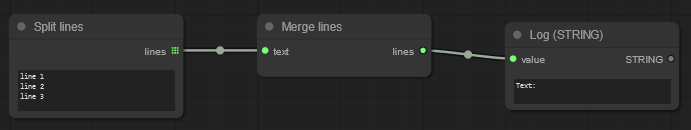
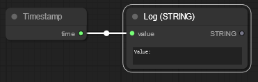
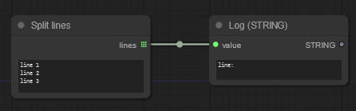

# Anatomy of a custom node
Below are the different options of a custom node in **alphabetical** order.

## CATEGORY
The UI will create a menu that matches this path to let the user create the node
``` python
class Example:
    @classmethod
    def INPUT_TYPES(cls):
        return {
            "required": {
            },
        }

    CATEGORY = "path/to/node"
```

## FUNCTION
Indicate which function is called for processing
**NOTES:**
- **All** the parameters names must match the names in INPUT_TYPES but the order can change
- When returning a single value, return a list ending with a coma `(value,)`
``` python
class Example:
    @classmethod
    def INPUT_TYPES(cls):
        return {
            "required": {
            },
        }

    FUNCTION = "NodeProcess"
    def NodeProcess(self):
        pass
```

## INPUT_IS_LIST
Using `INPUT_IS_LIST` indicates to the UI that we want to recive **ALL** inputs in lists.
In the following diagram, the node `Merge lines` will be called only once and receive the list provided by `Split lines`


We will see in the console of the server:
``` text
Text: line 1
line 2
line 3
```

The `Merge lines`:
``` python 
class RF_TextMergeLines:
    @classmethod
    def INPUT_TYPES(cls):
        return {
            "required": {
                "text": ("STRING", { "default": "", "multiline": True }),
             }
        }

    # This indicates that we want to receive ALL inputs as arrays
    INPUT_IS_LIST = True

    RETURN_NAMES = ("lines",)
    RETURN_TYPES = ("STRING",)

    FUNCTION = "NodeProcess"
    def NodeProcess(self, text):
        return ("\n".join(text),)
```

## INPUT_TYPES
Use this method to tell the UI what inputs are expected by the node, for more information on how to configure them, see [input options](<inputs.md>)

To do so, return a dictionary, it **can** contain 3 sections:
- `"required"` are the inputs required by the node
    - If any is not connected, the UI will show an error.
    - This is the only key that **MUST** be in the returned dictionary.
- `"optional"` are the optional inputs for the node, no check will be done on them by the UI
- `"hidden"`: are inputs that contain raw data from the UI and are not displayed in the UI
``` python
class Example:
    # The @classmethod attribute is required on this method
    @classmethod
    def INPUT_TYPES(cls):
        return {
            # NOTE: This MUST be defined in the return
            "required": {
                # define required inputs here
             },
            
            # NOTE: Can be omitted if there are no hidden inputs
            "optional": {
                # define optional inputs here
            },

            # NOTE: Can be omitted if there are no hidden inputs
            "hidden": {
                # define hidden inputs here
            },
        }
```

## IS_CHANGED
Implement this method when a node's output can change outside of the UI.

**NOTES:**
- The name is misleading, the UI will refresh if the returned value is **different** from the last returned value
- All the parameters names must match the names in INPUT_TYPES but the order can change
- **Do not include** inputs of type EXTRA_PNGINFO as they will not be mapped and create an error

### Example
In the following diagram, the value of time will be evaluated each time the prompt runs



We will see in the console of the server:
``` text
Value: 2024-01-12 11:45:16
```

The code of the `Timestamp` node:
``` python
from datetime import datetime

class RF_Timestamp:
    @classmethod
    def INPUT_TYPES(cls):
        return { 
            "required": { }
        }

    # We use this to indicate that the output of the node changes outside of the UI
    @classmethod
    def IS_CHANGED(cls):
        # We need to return a value that is different than what we returned in the previous call
        return datetime.now()

    RETURN_NAMES = ("time",)
    RETURN_TYPES = ("STRING",)

    FUNCTION = "NodeProcess"
    def NodeProcess(self):
        return datetime.now().strftime("%Y-%m-%d %H:%M:%S"),
```

## OUTPUT_IS_LIST
Using the `OUTPUT_IS_LIST` in a node, it will call a next node multiple times during execution.

In the following diagram, the `LOG(STRING)` node will be called once per line (line 1, line 2, line 3)



We will see in the console of the server:
``` text
line: line 1
line: line 2
line: line 3
```

The `Split lines` node:
``` python
class RF_TextLines:
    @classmethod
    def INPUT_TYPES(cls):
        return {
            "required": {
                "text": ("STRING", { "default": "", "multiline": True }),
             }
        }

    RETURN_NAMES = ("lines",)
    RETURN_TYPES = ("STRING",)
    # We use this to indicate that we will return a list in the FIRST parameter
    OUTPUT_IS_LIST = (True,)

    FUNCTION = "NodeProcess"
    def NodeProcess(self, text):
        return (text.splitlines(),)
```

## OUTPUT_NODE
It tells the UI that this node is an output.

**NOTES:**
- At least one node in the whole prompt must have this flag otherwise the UI will show an error

``` python
class Example:
    @classmethod
    def INPUT_TYPES(cls):
        return {
            "required": {
                "input_name": ("INT", { "default": 0 }),
            },
        }

    OUTPUT_NODE = True
```

## RETURN_NAMES, RETURN_TYPES
These are arrays, the order of the values in them must match:
- `RETURN_NAMES` The names of the outputs of this node
- `RETURN_TYPES` The "types" of the outputs of this node

**NOTES:**
- These are not validated by the UI, they are only used to know what can connect to what
- When returning a single value, return a list ending with a coma `("name",)` or `("INT")`

In the following example:
- `name` is a `STRING`
- `age` is an `INT`
``` python
class Example:
    @classmethod
    def INPUT_TYPES(cls):
        return {
            "required": {
            },
        }

    RETURN_NAMES = ("name","age")
    RETURN_TYPES = ("STRING", "INT")

    FUNCTION = "NodeProcess"
    def NodeProcess(self):
        return (name, age)
```

## VALIDATE_INPUTS
Implement this method to perform custom validation of the inputs.
- The parameters must match the names from INPUT_TYPES
- The parameters order do not need to match the order of INPUT_TYPES
- Thep parameters of type EXTRA_PNGINFO cannot be validated and will produce an error
- Return `True` to indicate success, anything else will be forwarded to the UI as an error for the node
``` python
class Example:
    @classmethod
    def INPUT_TYPES(cls):
        return {
            "required": {
                "first_name": ("STRING", { arguments }),
                "last_name": ("STRING", { arguments }),
            },
        }

    def VALIDATE_INPUTS(first_name, last_name):
        if(first_name == last_name):
            return "First name and last name are the same."
        return True
```

**NOTES:**
- It is not possible to define multiple VALIDATE_INPUTS methods, if you do, only the last one will be used and the others will be ignored
- The error message will be the same for all inputs (bug?)
``` python
class Example:
    @classmethod
    def INPUT_TYPES(cls):
        return {
            "required": {
                "first_name": ("STRING", { arguments }),
                "last_name": ("STRING", { arguments }),
            },
        }

    # This method will be ignored
    def VALIDATE_INPUTS(first_name):
        if(first_name == ""):
            return "Value cannot be empty."
        return True
    
    # This method will be ignored
    def VALIDATE_INPUTS(last_name):
        if(last_name == ""):
            return "Value cannot be empty."
        return True

    # This method will be used for validation
    def VALIDATE_INPUTS(first_name, last_name):
        if(first_name == last_name):
            return "First name and last name are the same."
        return True
```

